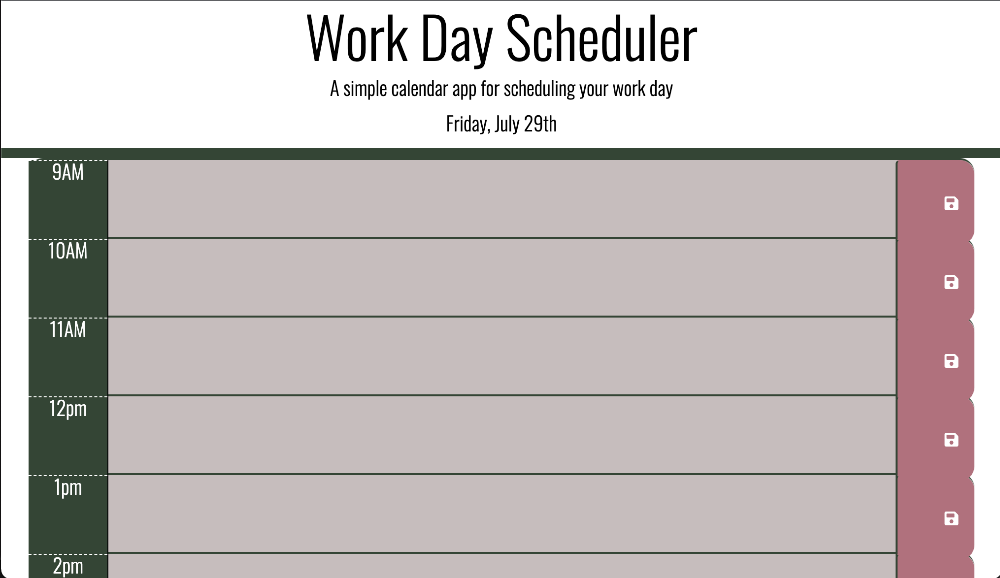
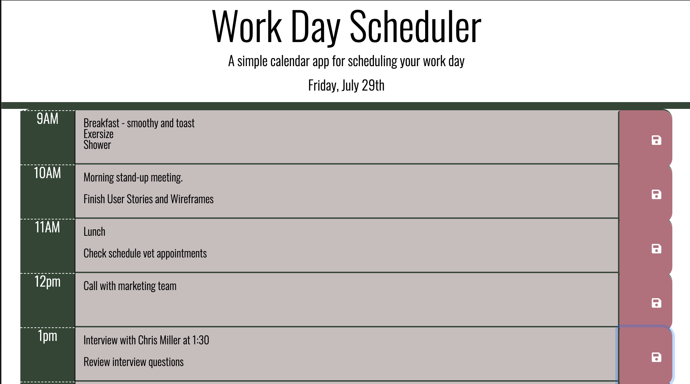
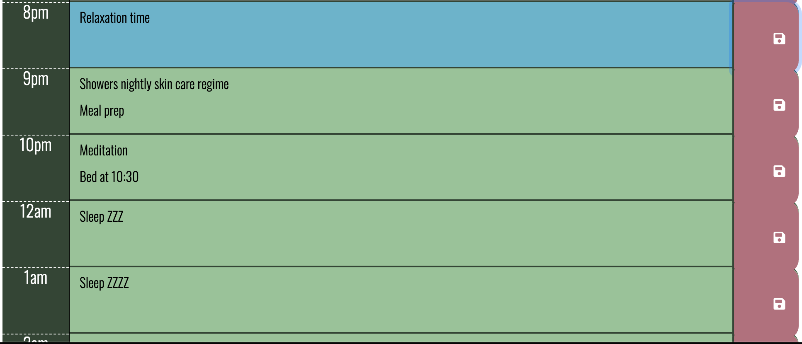

# agenda_codyp

## Description

For this project I wanted to create a project that took advantage of using momen.js that I could also benifit from in my every day life. I decided to create this daily agenda to help me stay orginized and keep me on top of my daily reqirments. The app's shining feature is the time and date feature that displays and changes color of each time slot depending on the time. This app also makes use of local storage to save each item in every given time slot. For styleing and page layout I used Bootstrap and CSS. 

## Installation
This project has been deployed to GitHub Pages. To get this project up and running, you can follow the deployment link. Or, download the sources files to use this as a template in VS Code. 

Github deployed IO link
- [GitHub Pages](https://cpolland.github.io/agenda_codyp/)

## Usage
The intial landing state of the Page. At the top the date changes to the current day with each time slot changing colors depending on what time it is. 

You can enter and event in each time slot and press the save button and it will save in local storage.

The color of the time slots change depending if the slot is in the past, present, or future. 

## Credits

This was a solo project worked on by Cody Polland.

## Badges

## Features
- Date at the top updates to the current day.
- Time slots change color depending on the time of day relection what has passed, the current time slot, and what time slot are to come. 
- The save button saves each time slot to local storage. 
